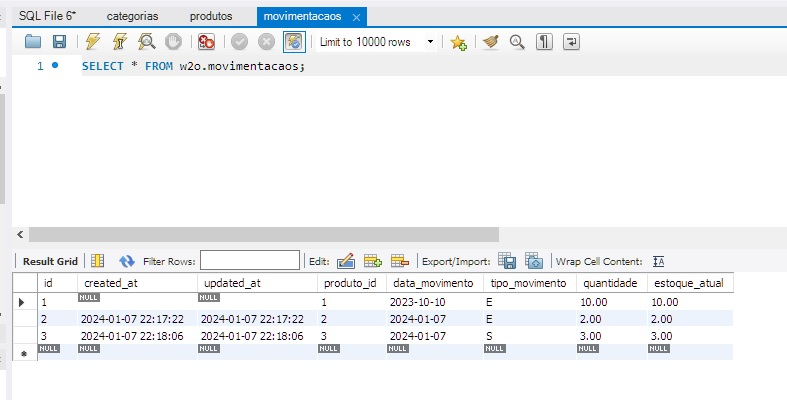
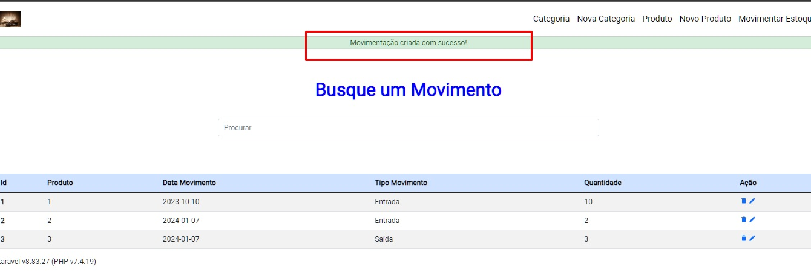

# Gerenciamento de estoque - W2O

* v01_produtos: foi a versão entregue para este teste.
* Estoque: é a versão atual que estou trabalhando neste momento.

Caso aconteça algum problema, que não de apenas para recomeçar uma aula, irei recomeçar todo o projeto novamente , até sair da forma que preciso.


## Arquitetura

O que estou usando para o sistema funcionar

* PHP (7.4.19 );
* Composer (2.3.10);
* Laravel (8.6.12);
* MySQL (8.0.33);
* Icon:    

	<script src="https://unpkg.com/ionicons@4.5.10-0/dist/ionicons.js"></script>
	
	
## Documentação

Onde encontrar as informações de Laravel:

	https://laravel.com/docs/10.x
	
* laracasts:

	https://laracasts.com/
	
* notícias / novidades:

	https://laravel-news.com/
	
* migrations:

	https://laravel.com/docs/10.x/migrations
	
* tipos de colunas das migrations:

	https://laravel.com/docs/10.x/migrations#available-column-types
	
* modificadores das colunas da migration:

	https://laravel.com/docs/10.x/migrations#column-modifiers
	
* indices para migrations:

	https://laravel.com/docs/10.x/migrations#indexes
	
* migrations rollback:

	https://laravel.com/docs/10.x/migrations#rolling-back-migrations
	
* migrations campos tabela:

	https://laravel.com/docs/10.x/migrations#available-column-types
	
	
	
## Entidade

Denominação dada geralmente a classe de objetos que se quer declarar ao se usar em geral. Por exemplo, se queremos trabalhar com produtos, a entidade será "produto" esta mesma entidade poderá ser apresentado no plural, singular,  maiusculo, minusculo e de outras formas como for conveniente para o momento. 

Para fins de melhor compreender, todos os exemplos apresentado usaram a entidade <b style="color:blue; size:14px" >Evento</b>. 

	
## Convenções de nomes

Os nomes das entidades devem seguir determinados padrões para ser reconhecido pelo laravel. Por exemplo:

* Tabelas: serão escritas no plural e em minusculo (eventos);

* Model: primeira letra em Maiusculas, as restantes em minusculo e no singular (Evento);

* Controller: Primeira letra em maiusculo, restante do nome em minusculo, no singular, seguido pela palavra "Controller", sem espaço entre a entidade e a palavra "Controller" (EventoController). 

Cuidado com as palavras que o plural em português é diferente do plural em ingles. No idioma inglês para representar o plural, acrescenta um 's' no final de cada palavra. Em português, acrescentar o 's' pode não fazer sentido. Exemplo: entidade movimentação,  no plural ficaria movimentações, entretanto o laravel irá formar "movimentacaos".  
O que não será encontrado pelo banco de dados. 


Na tela pode se mostrar qual a versão do Laravel e do php se esta usando.

<code>Laravel v{{ Illuminate\Foundation\Application::VERSION }} (PHP v{{ PHP_VERSION }})
</code>


## Estrutura da Blade

Todas as blade terão a mesma estrutura, apenas repetir:

<code>@extends('layouts.main')
	@section('title', 'titulo desta blade') 
	@section('content')
	@endsection
</code>


## Controllers

Criando os controles através do artisan.

Abrindo um novo navegador, indo para o mesmo diretório e digite o comando:

	php artisan make:controller CategoriaController
	
	php artisan make:controller ProdutoController
	
	php artisan make:controller MovimentacaoController
	
## Banco de Dados

Criando o banco de dados: CREATE SCHEMA `w2o` ;

Criando as tabelas via migration.


	
	
## Migrate

No nosso exemplo usaremos o banco já existente, portanto algumas migrations não será refeito. Como produto, categoria. Mas a migration de 'Movimentacoes' será refeita. 

Para verificar a situação das migrations:

	php artisan migrate:status
	
Para refazer as tabelsa no banco (sem salvar as informações)

	php artisan migrate:fresh
	
Para adicionar um novo campo, a uma tabela já existene:

	php artisan make:migration add_nome-do-campo_to_nome-da-tabela_table
	


Como eliminar este campo, que foi criado agora
	
	php artisan migrate:rollback
	
Apenas ver o que o rollback varia sem executar:

	php artisan migrate:rollback --pretend
	
Reverter(desfazer) todas as migrations já feitas:

	php artisan migrate:reset
	
Desfazer e refazer toda a estrutura do banco de dados:
	<b style="color:red;size:16px">Cuidado</b>

	php artisan migrate:refresh
	
	<b style="color:red;size:16px">Cuidado</b>
	
Refazendo apenas as ultimas 5 migrations:

	php artisan migrate:refresh --step=5
	
Alguns tipos de bancos que são aceitos nas migrations:  id, timestamp, text, sting, boolean, integer, ...
	
## Receber e enviar ao Banco

As conexões do nosso aplicativo com o banco de dados será realizada através da Model, será nestes arquivos que faremos as importações e exportações para o banco. 

## Model

As model são realizadas através do artisan

	php artisan make:model Event
	
Quase não se modificará a Model,  mas suas actions são essenciais para o Controller poder receber e enviar as informações do banco e para o banco. 


## Controller com a Model

Com a Model criada, temos de informar ao Controller que ele usará a Model. 

Assim dentro do controller, chamamos a model:

~~~php
	use App\Models\Evento
~~~
	
E dentro da action index chamamos a função principal desta action. 

~~~php
	$events = Evento::all();
~~~


## Pastas

## Tabelas

Haverão duas tabelas principais: Produtos e Categorias;

Criando informações da tabela Categorias:

	INSERT INTO categorias 
	( created_at, updated_at, nome, descricao)
	VALUES
	( now(), now(), 'ESCOLAR','Material Escolar' ),
	( now(), now(), 'CONSTRUÇÃO','Material de Construção' ),
	( now(), now(), 'ALIMENTAÇÃO','Produtos de Alimentação' );


Criando informações da tabela Produtos:

	INSERT INTO produtos 
	( nome, descricao, preco, foto, data_vencimento, created_at, updated_at, sku)
	VALUES
	( 'Leite', 'alimento liquido -  origem animal', 3.50,'', '2023-12-30', now(), now(),  'LEV-JN-SL-36-GN' ),
	( 'Mesa', 'material escritorio -  mesinha para o cha ', 395.50,'', '2023-12-30', now(), now(), 'CELIPXCE64'  ),
	( 'Arroz', 'alimento em graos', 5.50,'', '2024-12-30', now(), now(),  123654789 );


Criando informações da tabela Movimentação( movimentacaos):

	INSERT INTO movimentacaos 
	( produto_id, data_movimento, tipo_movimento, quantidade, estoque_atual)
	VALUES
	( 1, '2023-10-10', 'E', 10, 10 );


## Informações importantes

SKU é um código único, recomendável ter de 4 a 8 caracteres e pode ter letras e números.
Escolhi a quantidade máxima de 20 caracteres.
Deve ser escrito em letras Maiusculas, e evitar as letras 'l' e 'o' e os números 1 e 0 ;


## Iniciando 

Para iniciar o servidor: 

	php artisan serve
	
	
### Adicionando registros 

No laravel para adicionar registros no banco de dados será necessários alguns processos:

* criação do formulário para o usuário digitar os dados.

A criação do o form será realizada na View ( create.blade.php );

* Criação da Rota (web.php);

Quando é criada uma nova view, deve se informar qual a rota que devemos chamar ela, qual o tipo de ação que esta rota terá e para qual função dentro do controller ela deve ser dirigida. 

~~~php
	Route::post('events', [EventController::class, 'store')
~~~
	
O método **store** é padrão do laravel ( não é obrigatório, mas é o recomendável) será ele que será responsável pelo envio dos dados para o banco de dados. 

* Criação da Action dentro do Controller 

Dentro do controller, devemos criar a action que irá receber as informações do formulário e encaminhar para o banco. 

Para capturar as informações do formulário  usaremos a variável **$request**.

Chamamos a model do banco e passamos cada um dos campos do formulário para os campos do banco.

Chamamos o método que salva as informações no banco. 

E redirecionamos para a página principal, ou a página que desejarmos.

~~~php	
    public function store ( Request $request){
		$event = new Event;
		
		$event->titulo = $request->titulo;
		$event->descricao = $request->descricao;
		
		$event->save();
		
		return redirect('/');
	}
~~~
	
Para enviar as informações do formulário para a action store, o formulaário deve ter uma diretiva de CSRF. 


<details>

<summary>CSRF</summary>

### O que é CSRF ?

CSRF é um tipo de ataque que explora a confiança de um aplicativo em relação a um usuário autenticado. Em um ataque CSRF, o invasor faz com que o usuário execute uma ação em um aplicativo sem o conhecimento ou consentimento do usuário. Isso é feito enganando o aplicativo para pensar que a solicitação está sendo feita pelo usuário autenticado quando, na verdade, é o invasor que está fazendo a solicitação.

### Saiba mais:

https://www.linkedin.com/pulse/vulnerabilidades-do-csrf-token-laravel-como-evit%C3%A1-las-fabio-andolphi/

https://laravel.com/docs/10.x/csrf


</details>


Após a tag de abertura do formulário adicionamos a diretiva do laravel  do CSRF. 

```@csrf```
	
Adicionamos a informação no formulário, e clicamos para salvar os dados. Após isto as informações enviadas pelo formulário estarão salvas no banco de dados. 



Imagem acima mostrando como ficou o banco de dados. 

Neste momento, no campo 'Estoque_Atual', estamos apenas replicando a informação de 'Quantidade'. Este campo será retirada da Tabela "Movimentacaos".


### Flash Messages

Mensagens adicionadas para o Usuário, via **session**, estas mensagens serão adicionadas no Controller através do método **with**. O blade irá verificar se há ou não as Flash messages pela diretiva **@session**.


Portanto dentro do Controller, dentro do Método store, antes de finalizar o redirecionamento,  iremos acrescentar o método **with**. 

O método with contém uma array com chave e conteudo.

~~~php
	return redirect('/')->with('msg', 'Evento Criado com Sucesso!');
~~~

Para o nosso exemplo a chave do Método WITH é **msg**,  e o conteúdo desta chave é **Evento criado com sucesso!**

Desta forma a mensagem foi criada,  mas precisamos receber e mostrar esta mensagem para o usuário.
  
Assim teremos de modificar o nosso blade principal ( main.blade.php). 

Antes da apresentação do conteudo da página [@yield('content')], iremos fazer a verificação da existência da flah message,  e se sim, iremos apresentar ela em tela. 


~~~html
	@if(session('msg'))
        <p class="msg">{{ session('msg') }}</p>
    @endif
    @yield('content')
~~~

Assim se houver alguma flash message o aplicativo mostrará para o usuário e após apresentará o conteudo da tela. 




### Adicionar Mensagens 

Vamos adicionar uma imagem dentro do nosso sistema. 

Primeira parte vamos mudar o 'form' para que ele aceite pegar arquivos. 

~~~html
	<form action="/" method="POST" enctype="multipart/form-data">
~~~

Nesta mesma view (create.blade.php) onde mudamos o form, devemos acrescer  um input do tipo "type" para buscar os arquivos. 

~~~html
	<input type="file" name="img">
~~~

No controller temos de modificar como a imagem será recebida.

Iremos verificar se o arquivo existe e se este arquivo é valido. 

~~~php
	if( $request->hasFile('img') && $request->file('img')->isValid() ){
~~~

Depois da verificação iremos salvar a extensão do arquivo que chegou. 

~~~php
	$requestImagem = $request->img;
	$extension = $requestImagem->extension();
~~~

Iremos renomear o arquivo recebido

~~~php
	$imagemNome = md5($requestImagem->getClientOriginalName().strotime('now')).'.'.$extension;
~~~

Este será o nome do arquivo que será salvo no banco de dados, e o nome do novo arquivo (imagem/foto) que salvaremos no nosso aplicativo. 

Salvar a imagem em pastas dentro do aplicativo

~~~php
	$request->img->move( public_path('img/events'), $imagemNome );
~~~


Salvar a imagem no banco de dados

~~~php
	$event->imagem =  $imagemNome ;
~~~

### Adicionar novo campo

Adicionar um novo campo em uma tabela já existente e já contendo informações.

Para incrementar um campo em uma tabela já existente usaremos o **php artisan migration**

<code>php artisan make:migration add_imagem_to_events_table</code>

* add: seria adicionar;
* imagem: seria o nome do campo a ser adicionado;
* to: para onde ; 
* events: nome da tabela que receberá a nova coluna;
* table: comando que informa que é uma tabela ;

Dentro da nova migration, na função **UP** iremos informar o que deve ser salvo. 

~~~php
	$table->string('imagem');
~~~

Dentro da função **Down** iremos informar o que deve ser realizado para eliminar esta coluna. 

~~~php
	$table->dropColumn('imagem');
~~~

Configurado como a migrate deve ser tratada. Agora executar a migrate.

<code>php artisan migrate</code>

### Mostrando a imagem

Agora que o campo foi criado no banco de dados(migrate e controller), a informação já pode ser adicionado pelo usuário (blade e controller) esta na hora de apresentar a imagem para o usuário. 

A apresentação da imagem será realizada na na view (welcome.blade.php)

~~~html
	image}}" >
~~~

Ciclo da imagem completado ( para este ciclo).

### Resgatando UM registro do banco

No laravel usaremos o **Eloquent** para resgatar apenas um registro do banco, com o método **findOrFail**

Criamos a rota que irá mostrar apenas os detalhes de um único registro no banco. 

Esta rota será chamado na página principal de rotas ( web.php);


~~~php
	Route::get('events/{id}' ,  [EventController::class, 'show']);
~~~ 

O método **show** é o padrão para o laravel saber que deve trazer as informações de apenas um registro. 

Agora na página que irá mostrar os detalhes do evento ( welcome.blade.php) iremos mudar o link para redirecionar para a página de trabalho. 

~~~html
	<a href="events/{{ $event->id }}" >
~~~

Adicionado no controller a action  **show** que buscará o dado informado no banco. 

~~~php
	public function show( $id ){
		$event = Event::findOrFail($id);
		return view ('events.show' , ['event' => $event]);
	}
~~~

Dentro da action show iremos buscar dentro do model as informações apenas deste id,  e retornaremos para a view show ( eventos/ show.blade.php) ;

Devemos criar a view que irá mostrar os detalhes desta informação. Dentro da pasta principal iremos criar a view **show.blade.php**.

Dentro da blade, iremos apresentar as informações deste ID. 

### Salvando JSON  no banco

JSON será usado para guardar um conjunto de informações no banco de dados. Geralmente são arquivos tipos checkbox.

Será criada uma coluna na tabela do tipo **Json**.
Cria-se uma nova migration.

	<code>php artisan make:migration add_itens_to_events_table</code>
	
Dentro da estrutura da migration, na função 'up' usaremos a criação da coluna do tipo json. 

~~~php
	$table->json('itens');
~~~

E dentro da função 'down' iremos identificar qual a tabela que será elimina.

~~~php
	$table->dropColumn('itens');
~~~

No banco de dados, a coluna json , ficará salva como "longText'.

Na view, deve ser adicionado o input que terá as informações para serem checadas.


~~~html
	<input type="checkbox" name="itens[]" value="cadeira"> Cadeira
~~~

Na parte do "name", o nome deste input deve ser com '[]', para o sistema enteder que receberá mais de um dos checks.

No controller desta página receberemos o valor do input de forma normal, assim como receberiamos de qualquer outro input. 

~~~php
	$event->itens = $request->itens ;
~~~

O Model precisa saber que estes dados serão recebidos como array e não como string. 
Assim dentro do Model, criamos a variavel **casts**, tipo protegida,  contendo o tipo "itens" como sendo uma "array".

~~~php
	protected $casts = [ 'itens' => 'array' ] ;
~~~

Ao criar um novo evento no banco,  e neste evento sendo escolhidos alguns itens que terão. 
Quando submete ao banco de dados, no banco de dados, teremos uma array salva no campo itens, e não strings.

Agora devemos apresentar as informações salvas no banco. Para isto usaremos a view show.blade.php. 
Nesta view,  iremos adicionar o o UL deste item  e chamamos os itens com o foreach para ser apresentado cada um deles. 


~~~html
	<ul id='itens'>
		@foreach($event->itens as $item)
			<li>{{$item}}</li>
		@endforeach
~~~

Desta forma a view irá apresentar todos os itens selecionados que constam no banco de dados. 


 


	
	
	


